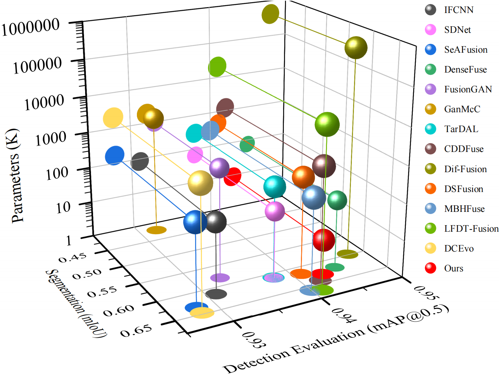
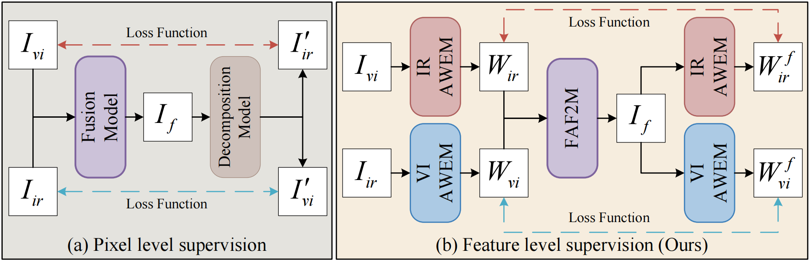
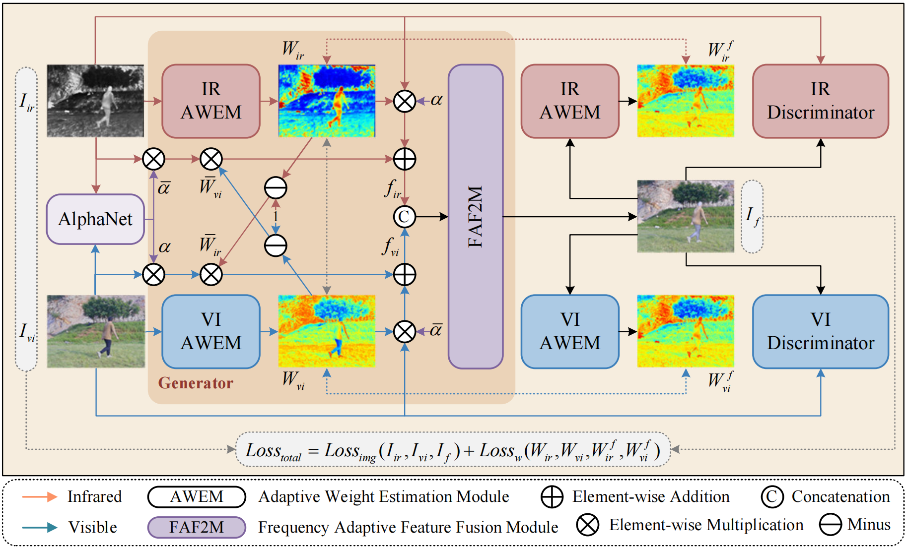

# DWSFusion🚀
This is official Pytorch implementation of "DWSFusion: Dual Weight Supervision for Lightweight Infrared and Visible Image Fusion"

## 📜Abstract
Infrared and visible image fusion (IVIF) integrates complementary information from distinct modalities into a single, comprehensive representation. However, most existing methods rely on heavy architectures that indiscriminately retain source information, often overlooking the detrimental effects of redundant information on fusion performance. To address this limitation, this paper proposes DWSFusion, a lightweight IVIF framework driven by dual-weight supervision and cross-perception strategies. Specifically, we design a Frequency-Adaptive Attention-based Weight Estimation Module to capture modality-specific features, which are then enhanced via a cross-perception strategy to facilitate inter-modal interaction. Subsequently, these refined features are integrated by a Frequency-Adaptive Feature Fusion Module to generate the fused image. Diverging from conventional pixel-level constraints, we introduce a novel feature-level dual-weight supervision strategy. This mechanism utilizes the weight maps derived from the fused image to backward-supervise the source weights, establishing a closed-loop feedback mechanism that effectively suppresses invalid redundancy while sharpening feature selection. Furthermore, a dual-discriminator framework combined with multi-scale structural similarity loss is employed to ensure structural fidelity and realistic texture preservation. Extensive experiments demonstrate that DWSFusion achieves superior results in key fusion metrics and maintains highly competitive performance in downstream high-level vision tasks. Notably, these results are realized with significantly reduced model parameters, striking an optimal trade-off between performance and efficiency.

## ✨Highlight
- An end-to-end lightweight network for IR/VIS fusion is proposed.
- Dual-weighted supervision strategy preserves useful features and reduces redundancy.
- Cross-perception strategy promotes mutual enhancement among multimodal features.
- Dual discriminators and MS-SSIM losses further preserve the information distribution.
- The approach balances fusion performance, model size, and advanced task capabilities.
  
  


## 🪢Framework

The framework of the proposed dual-weight supervision strategy at the feature level and cross-weight strategy.  

## 🌻Network Architecture

The architecture of the DWSFusion. 

## 🪄Code Usage
### Environment
```pip install -r requirements```
### To Train
Run ```python main.py``` to train your model. The training data is obtained by extracting patches from the images in the MSRS dataset.
For convenient training, users can download the training dataset from [here](https://pan.baidu.com/s/16qbgI3HK7Y45H0GwZkc8vQ?pwd=Qi42), in which the extraction code is: Qi42.
Put this tar file into folder data.
### To Test
Run ```python test.py``` to test the model.  
M3FD dataset can be downloaded from [M3FD](https://pan.baidu.com/s/1SbqLk2YSAYr_1NKVCIeNsQ?pwd=Qi42), in which the extraction code is: Qi42.  
Put this tar file into folder data/test_data.
### Recommended Environment
- torch==1.11.0+cu113
- torchvision==0.12.0+cu113
- numpy==1.26.4
- opencv-python==4.10.0.84
- mmcv-full==1.5.3

## 📌Fusion Example
Qualitative comparison of DWSFusion with 13 state-of-the-art methods from the TNO, RoadScene, MSRS and M3FD datasets.


## 📌Detection Results
Detection results for infrared, visible and fused images from the MSRS dataset. The segmentation model is YOLOv5s.  


## 📌Segmentation Results
Segmentation results for infrared, visible and fused images from the MSRS dataset. The segmentation model is Deeplabv3+, pre-trained on the Cityscapes dataset.


## 🧷If this work is helpful to you, please cite it as：

```
aaa
```


## 😊Contact
If you have any questions, please contact 420269520@qq.com
